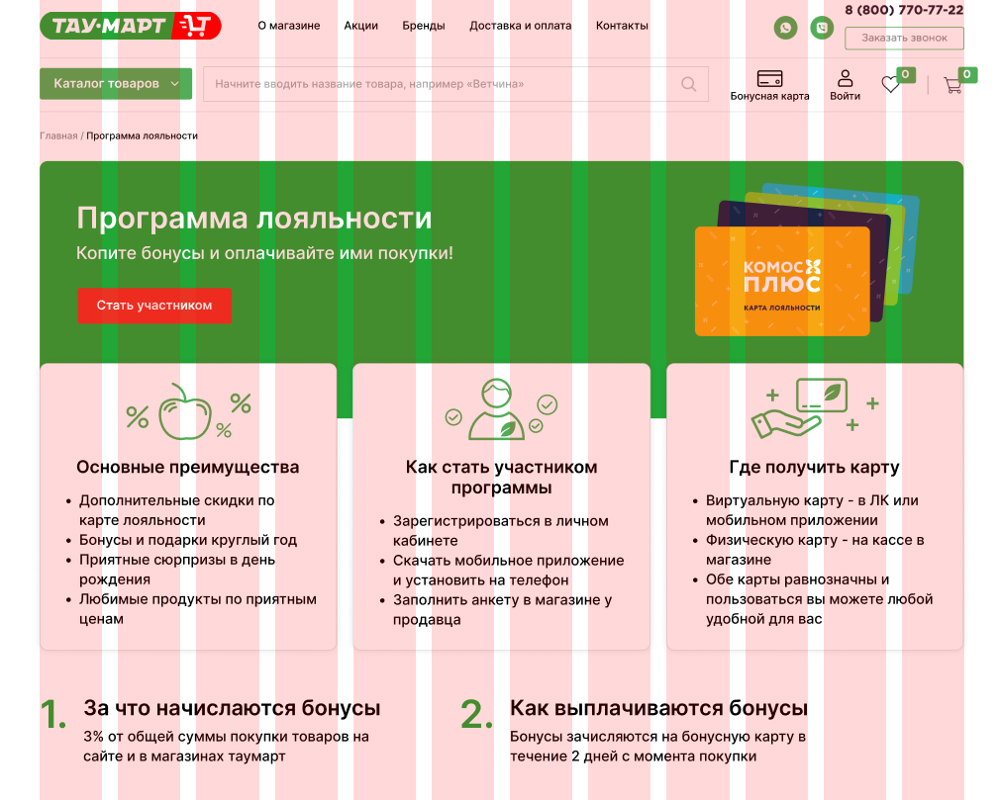
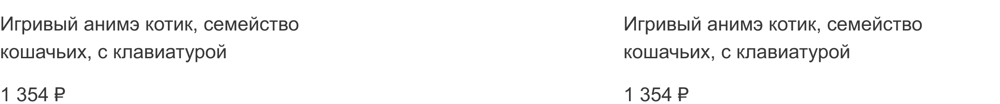
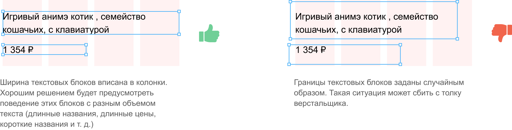
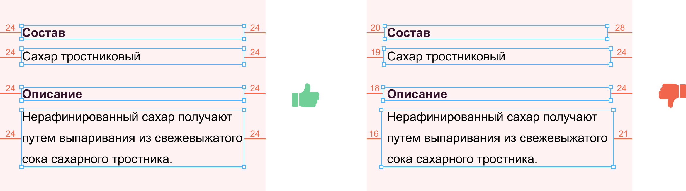
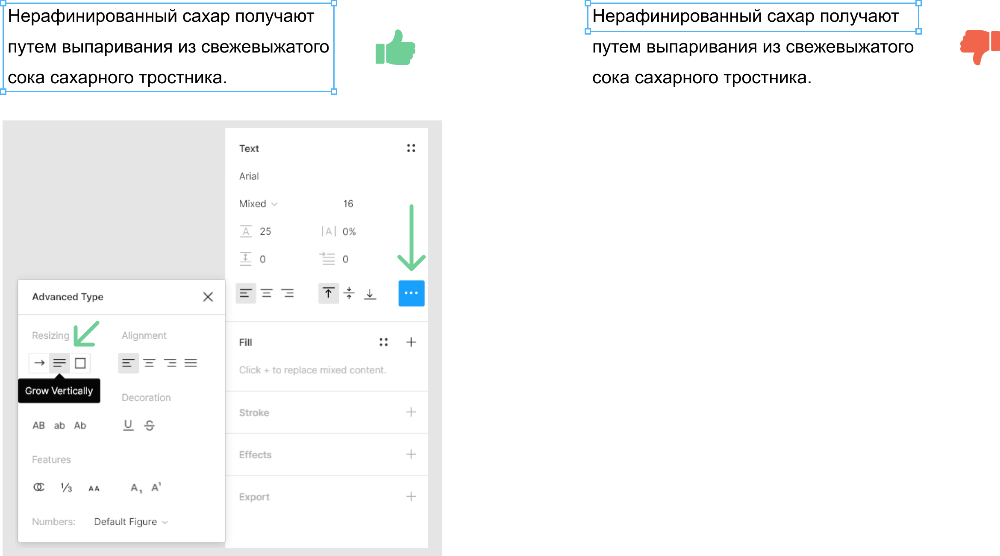
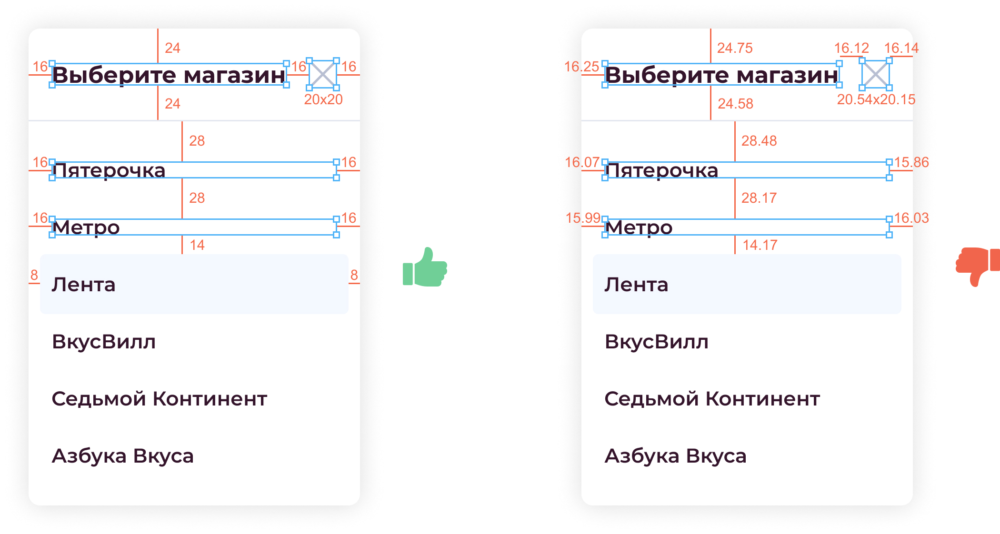
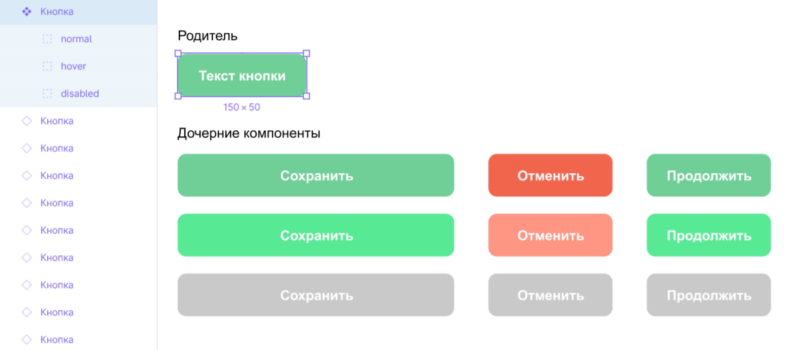
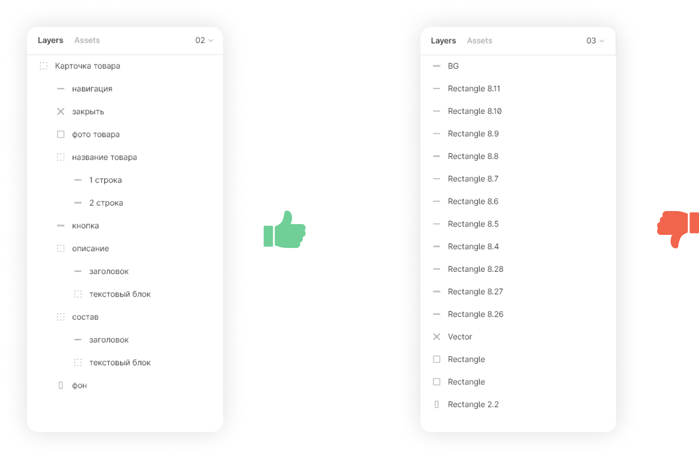
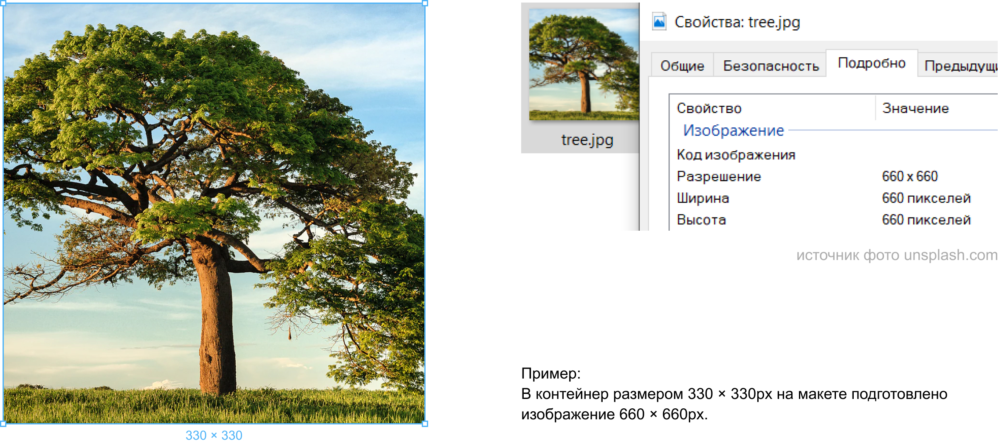

# 🎨 Требования к дизайну (для Figma)

> Качественный дизайн = меньше правок, быстрая верстка, довольные все 🚀

---

## 🔍 Частые ошибки
1. ❌ Разные размеры шрифтов и отступов в одинаковых блоках → не компонентный подход.
2. ❌ Макет сделан под 1920px без адаптации до 1024px → ломается верстка.
3. ❌ Дробные пиксели и случайные отступы → хаос при разработке.

---

## 1. Используй сетку

Сетка помогает структурировать контент — как метроном в музыке, задаёт ритм.

**Рекомендация:** 12 колонок (или иное обоснованное количество).  
Главное — соблюдать её края и отступы.

📖 [Хорошая статья про сетки](https://habr.com/ru/post/344910/)

---

## 2. Задавай текстовым блокам осознанные размеры

Описание, цена, кнопки и прочие блоки должны иметь одинаковые стили и размеры, если визуально они одинаковы.  
Это упрощает верстку и делает интерфейс системным.

---

## 3. Следи за боковыми отступами

Отступы должны быть логичными и кратными (8px, 16px, 24px).  
Если они отличаются — только по смыслу, не случайно.

---

## 4. Используй Grow Vertically для текста

Текстовые блоки должны автоматически увеличиваться по высоте — не фиксируй её вручную.  
Так разработчику не придётся гадать, где кончается текст.

---

## 5. Целые значения в пикселях

Все размеры и отступы должны быть **целыми значениями**.  
Дробные пиксели (например, `23.5px`) → проблемы при верстке.

---

## 6. Компоненты и UI Kit

Создавай и переиспользуй **компоненты** — кнопки, карточки, шапки, футеры и т.д.  
Из них формируется **UI Kit**, который помогает сохранять единый стиль и ускоряет работу.

📖 [Atomic Design](https://habr.com/ru/post/249223/)  
📖 [Как атомарный дизайн облегчает жизнь дизайнерам и делает счастливее заказчика](https://habr.com/ru/companies/pyrobyte/articles/759438/)

**В UI Kit должны быть:**
- кнопки, ссылки и их состояния (`hover`, `active`, `disabled`);
- текстовые стили (`h1–h4`, `p`, `ul`, `ol`, `blockquote`);
- палитра, иконки, формы;
- сетка и базовые отступы.

> UI Kit — это не просто набор стилей, а отражение компонентной структуры проекта.

---

## 7. Называй группы и фреймы осмысленно

Чёткие имена помогают другим понять структуру:  
`Header / Logo`, `Card / Product`, `Button / Primary` и т.д.

---

## 8. Растровая графика

Подготавливай растровые изображения в **2x–3x разрешении** для ретины.  
Всё, что можно — делай в **векторе (SVG)**.

---

## 9. Шрифты

- Используй бесплатные или лицензированные шрифты.
- Без дробных кеглей и межстрочных интервалов.
- Максимум 2 семейства шрифтов.
- Все одинаковые элементы → одинаковые стили текста.
- Обрати внимание на тему **vertical trim** в Figma:

  статья [“Why you shouldn’t use vertical trim in Figma (yet)”](https://blog.logrocket.com/ux-design/vertical-trim-figma/) рассматривает, как опциональное обрезание верхнего и нижнего пространства текстового блока может влиять на верстку и пригодность дизайна к коду. :contentReference[oaicite:2]{index=2}
  > В частности:
  > - вертикальный trim обрезает пустое пространство над первой строкой и под последней, что может выглядеть точно в дизайне;
  > - но на вебе ещё не поддерживается: перевод в CSS (`text-box-trim`) работает только частично, что ведёт к расхождениям между макетом и версткой.
      **Вывод:** пока используем обычный TextBox / Auto-Height с целыми значениями и проверенными стилями, чтобы избежать сюрпризов при верстке. Не использовать `text-box-trim`

---

## 10. Адаптив

Делай три макета под ключевые разрешения:

| Устройство | Ширина    | Колонки |
|-------------|-----------|----------|
| 📱 Мобильный | 320–375px | 4 |
| 💻 Планшет | 768–960px | 8 |
| 🖥 Десктоп | 1200px+   | 12 |

⚠️ Делая макет, не забывай, что между ними есть другие разрешения —  
не «лепи» элементы на большой ширине и учитывай, что экран может быть меньше.

---

## 11. Иконки

- Делай вектор (SVG).
- Если используешь библиотеку (Material, FontAwesome и т.д.) — укажи её в задаче.

---

## 12. Технические требования

- Все телефоны и e-mail → кликабельные (`tel`, `mailto`).
- Ссылки должны отличаться по цвету.
- На формах — предупреждение о персональных данных.
- Cookie-сообщение показывается 1 раз.
- После отправки формы — сообщение об успехе.

---

> 💬 Делай дизайн как систему, а не как картинку.
